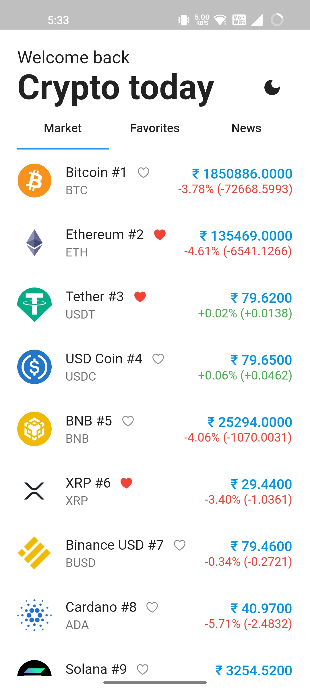
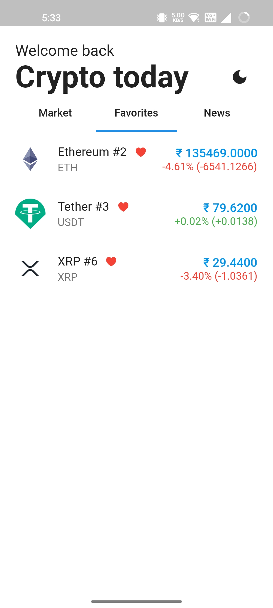
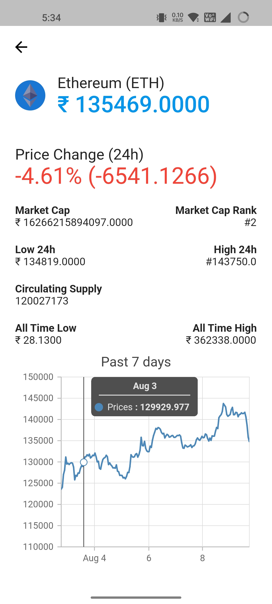

# crypto_tracker

Cryptocurrency Tracker.

# Features

0. A Simple Flutter app get live Cryptocurrency prices and news related to Cryptocurrencies.
1. User can toggle between dark and light theme.
2. User can refresh to get live updates.

 | Light                                      | Dark                                       |
   | ------------------------------------------ | ------------------------------------------ |
   |  |  |
   |  |  |
   |  |  |
   |  |  |
   |  |  |

## 🔌 Plugins

| Name                     | Usage                                                                     |
| ------------------------ | ------------------------------------------------------------------------- |
| [**Provider**]           | State Management                                                          |
| [**HTTP package**]       | HTTP requests                                                             |
| [**Shared Preferences**] | Used to store data locally in key value pairs and can be retreived easily |
| [**SyncFusion Charts**]  | Used to plot charts                                                       |
